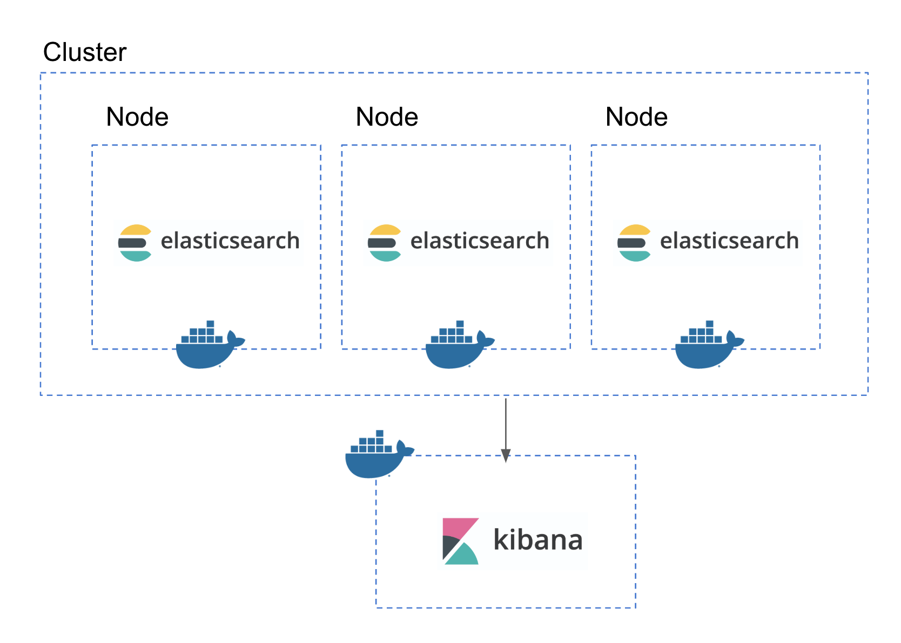

# go_elastic_starter

 [](https://codeclimate.com/github/po3rin/go_elastic_starter/maintainability)

## Go言語 + Docker + Elastic Stack (Elasticsearch Logstash Kibana) で始める BI環境構築 ハンズオン


Docker + Go言語 + Elasticsearch でAPIを作っているのですが、Elasticsearchの便利さはもちろん、BI環境の構築をする際にそのスムーズさに感動したので、今回はGo言語での開発を例にハンズオン形式で紹介します。Dockerで立ち上げて、Elasticsearchで作るCluster構成や、LogstashによるBI環境の立て方を学びます。

コードはこちら

## 今回作るもの & Stack紹介


Go言語 + Docker + Elastic Stack で簡単なBI環境を作ります。APIで出るログは Logstash で収集し、Slackへの通知 + Elasticsearch へのログ保存を行います。Elasticsearchに入ったデータはKibanaで可視化できるようにします。

### Elasticsearch


Elasticsearch は Elastic 社が開発しているオープンソースの分散型RESTful検索/分析エンジンです。検索速度や分析柔軟性に優れています。

### Kibana


Kibana も Elastic社が開発しているビジュアライゼーションのためのツール。Elasticserachというデータベースに入っているデータを様々な形式で描画することができます。

### Logstash


そしてこちらも Elastic社が提供するオープンソースのデータ収集エンジン。
リアルタイムのパイプライン処理で異なる種類のデータを統一的なフォーマットへ変換して任意の転送先へ送ることができる。
Log収集ツールとして使われているのをよくみる。


## Elasticsearch + Kibana 環境を Dockerで立てる。



まずは上の形を目指しましょう。ここでKibanaも立てます。
このセクションでは下記の形のファイル構成になります。

```bash
go-elastic-starter
├── docker-compose.yml
├── elasticsearch
│   ├── Dockerfile
│   └── config
│       ├── elasticsearch.yml
│       └── log4j2.properties
└── kibana
    └── Dockerfile
```

では早速、ElasticsearchとKibanaを立ち上げる準備をしましょう。

### Elasticsearch クラスターの立ち上げ

Elasticsearchからです。今回は3つのクラスター構成を試してみます。Elasticsearchではクラスターというもの中にノードという単位でElasticsearchが立ちます。今回は共通の設定は設定ファイルで渡し、node別の設定は docker-compose.yml の環境変数で渡します。

ではまず、elasticsearchディレクトリを作って、その中に Dockerfile を作ります。

```Dockerfile
FROM docker.elastic.co/elasticsearch/elasticsearch:6.5.1

# # kuromojiをインストールする場合
# RUN elasticsearch-plugin install analysis-kuromoji
```

config ディレクトリを作ってそこに Elasticsearch 設定用ファイル elasticsearch.yml を作りましょう。

```yml
network.host: 0.0.0.0

# bootstrap.memory_lock: true

### Cluster settings
discovery.zen.minimum_master_nodes: 2
```

elasticsearch.yml では クラスタや各ノード等の設定が可能です。今回はDockerでElasticsearchのクラスターを組むので、各ノードの個別の設定はdocker-compose.ymlで渡すことができるので、ここでは一旦共通の設定のみ行います。

そしてログ出力に関する設定を行います。log4j2.propertiesを作ります。

```properties
status = error

appender.console.type = Console
appender.console.name = console
appender.console.layout.type = PatternLayout
appender.console.layout.pattern = [%d{ISO8601}][%-5p][%-25c{1.}] %marker%m%n

rootLogger.level = info
rootLogger.appenderRef.console.ref = console
```

そして docker-compose.ymlに下記を追加します。

```yml
version: '3.6'
services:

# ...

    elasticsearch:
        build: ./elasticsearch
        container_name: elasticsearch
        environment:
            - "ES_JAVA_OPTS=-Xms512m -Xmx512m"
            - node.name=es01
            - cluster.name=go_elastic_starter_cluster
        ports:
            - '9200:9200'
            - '9300:9300'
        volumes:
            # - esdata01:/usr/share/elasticsearch/data
            - ./elasticsearch/config/elasticsearch.yml:/usr/share/elasticsearch/config/elasticsearch.yml
            - ./elasticsearch/config/log4j2.properties:/usr/share/elasticsearch/config/log4j2.properties

    elasticsearch2:
        build: ./elasticsearch
        container_name: elasticsearch2
        environment:
            - "ES_JAVA_OPTS=-Xms512m -Xmx512m"
            - node.name=es02
            - cluster.name=go_elastic_starter_cluster
            - "discovery.zen.ping.unicast.hosts=elasticsearch"
        volumes:
            # - esdata02:/usr/share/elasticsearch/data
            - ./elasticsearch/config/elasticsearch.yml:/usr/share/elasticsearch/config/elasticsearch.yml
            - ./elasticsearch/config/log4j2.properties:/usr/share/elasticsearch/config/log4j2.properties

    elasticsearch3:
        build: ./elasticsearch
        container_name: elasticsearch3
        environment:
            - "ES_JAVA_OPTS=-Xms512m -Xmx512m"
            - node.name=es03
            - cluster.name=go_elastic_starter_cluster
            - "discovery.zen.ping.unicast.hosts=elasticsearch"
        volumes:
            # - esdata03:/usr/share/elasticsearch/data
            - ./elasticsearch/config/elasticsearch.yml:/usr/share/elasticsearch/config/elasticsearch.yml
            - ./elasticsearch/config/log4j2.properties:/usr/share/elasticsearch/config/log4j2.properties
```

各ノードの設定は環境変数で渡します。

```bash
# Elasticsearchクラスタ立ち上げ
$ docker-compose up -d

# 立ち上げ確認
$ curl "localhost:9200/_cat/health?v"
```

これでノード3台のクラスターが完成しました！node.total が3であることを確認してください。

そしてこの勢いでKibanaを立ち上げます。一旦コンテナを落としておきましょう。

```bash
$ docker-compose down
```

### Kibana の立ち上げ

kibana ディレクトリを作って そこに Dockerfile を作りましょう。

```Dockerfile
FROM docker.elastic.co/kibana/kibana:6.5.1

# kibana にプラグインを入れる際にはここに記載
```

そして docker-compose.yml に追加！

```yml
version: '3.6'
services:

# ...

    kibana:
        build: ./kibana
        links:
            - elasticsearch
        environment:
            - ELASTICSEARCH_URL=http://elasticsearch:9200
        ports:
            - 5601:5601
```

これで立ち上げましょう

```bash
$ docker-compose up -d
```

http://localhost:5601 で Kibanaの画面が見れます。


これで Elasticsearch + Kibanaが立ち上がりました！

## Logstash を立ち上げる

logstash ディレクトリを作り、Dockerfileを作りましょう。今回はSlackへの通知も行うので pluginを追加します。このセクションで下記のような構成ができます。

```
```
.
├── Makefile
├── README.md
├── docker-compose.yml
├── elasticsearch
│   ├── Dockerfile
│   ├── README.md
│   └── config
│       ├── elasticsearch.yml
│       └── log4j2.properties
├── kibana
│   └── Dockerfile
└── logstash
    ├── Dockerfile
    └── logstash.conf
```
```

```Dockerfile
FROM docker.elastic.co/logstash/logstash:6.4.3

RUN logstash-plugin install logstash-output-slack
```

そして大事なlogstash.conf を作ります。Dockerfile と同じ階層におきます。
output を elasticsearch と slack に設定しています。

```conf
input {
    tcp {
    port => 5959
  }
}
output {
  elasticsearch {
    hosts => ["http://elasticsearch:9200"]
  }
  slack {
        url => ["{{ WEB_HOOK_URL }}"]
        channel => ["{{ #CHANNEL_NAME }}"]
        username => ["po3rin"]
        icon_emoji => [":simple_smile:"]
        format => ["%{message}"]
    }
}
```

```{{ WEB_HOOK_URL }}``` と ```{{ #CHANNEL_NAME }}``` は [Slack API](https://api.slack.com/) でアプリケーション登録して所得します。左のメニューの Incoming Webhooks から両方所得できます。

そして docker-compose.yml に Logstash に関する記載を追加します。

```yml
logstash:
    build: ./logstash
    volumes:
      - ./logstash:/logstash_dir
    command: logstash -f /logstash_dir/logstash.conf
    links:
      - elasticsearch
    ports:
      - "5959:5959"
      - "9600:9600"
```

```bash
$ docker-compose up -d
```

これでLogstashも立ち上がりました。確認してみましょう。

```bash
curl localhost:9600
{"host":"03ad2934dd30","version":"6.4.3","http_address":"0.0.0.0:9600","id":"ccf108c4-aaf5-40ae-ac37-41866641e3de","name":"03ad2934dd30","build_date":"2018-10-31T00:19:35Z","build_sha":"17e7a50dfb0beb05f5338ee5a0e8338e68eb130b","build_snapshot":false}
```

いいですね。ここでも次のセクションのためにコンテナを一度落としましょう

```bash
$ docker-compose down
```

## Go言語で作ったAPIサーバーから Logstash にログを送信する。

このセクションで最後の形まで持っていきます。


このセクションで最終的に下記のような構成になります。

```
.
├── Makefile
├── README.md
├── api_server
│   ├── Dockerfile
│   ├── go.mod
│   ├── go.sum
│   ├── logger
│   │   └── logger.go
│   ├── main.go
│   └── wait-for-logstash.sh
├── docker-compose.yml
├── elasticsearch
│   ├── Dockerfile
│   ├── README.md
│   └── config
│       ├── elasticsearch.yml
│       └── log4j2.properties
├── kibana
│   └── Dockerfile
└── logstash
    ├── Dockerfile
    └── logstash.conf
```

Go言語の開発環境を整えましょう。Go1.11以上を準備してください。そしてapi_serverディレクトリを作り、go.modを作ります。

```go
go mod init
```

そして同階層にmain.goを作ります。一旦 logging は設定しません。

```go
package main // import "api_server"

import (
	"fmt"
	"net/http"
)

func main() {
	mux := http.NewServeMux()
	mux.Handle("/", http.HandlerFunc(hello))
	http.ListenAndServe(":8080", mux)
}

func hello(w http.ResponseWriter, r *http.Request) {
	msg := "Hello Elastic Stack"
	w.WriteHeader(http.StatusOK)
	fmt.Fprintf(w, msg)
}

```

簡単ですね。がっつり開発していく前に Docker + fresh のホットリロード環境を作りましょう。
ここから解説しますが、詳しくは過去記事をご覧ください。

[Go v1.11 + Docker + fresh でホットリロード開発環境を作って愉快なGo言語生活](https://qiita.com/po3rin/items/9acd41ef428436335c97)

Dockerfileを作ります。

```Dockerfile
FROM golang:1.11.1

WORKDIR /api_server

COPY . .
ENV GO111MODULE=on

RUN go get github.com/pilu/fresh
```

このイメージでローカルでファイルを更新したらDockerコンテナ内でホットリロードできる環境が準備できました。
```docker-compose.yml``` に記載を追加します。

```yml
# ...

version: '3.6'
services:
  go_elastic_starter:
    build: ./api_server
    ports:
      - '8080:8080'
    volumes:
      - ./api_server:/go/src/go_elastic_starter/api_server
    command: fresh
```

早速立ち上げましょう。

```bash
$ docker-compose up -d
```

これでコンテナにserverが立ってます。

```bash
curl localhost:8080/
Hello Elastic Stack
```

これで開発環境が整いました！では早速 logger を設定しましょう。```main.go``` と同じ階層に ```logger/logger.go``` を作ります。

```go
package logger

import (
	"github.com/bshuster-repo/logrus-logstash-hook"
	"github.com/sirupsen/logrus"
)

// Log - log client.
var Log *logrus.Logger

func init() {
	logger := logrus.New()
	logstashHook, err := logrustash.NewHook("tcp", "logstash:5959", "from_logstash")
	if err != nil {
		panic(err)
	}
	logger.Hooks.Add(logstashHook)
	Log = logger
}

// Debug - shorthand Log.Debug
func Debug(msg string) {
	Log.Debug(msg)
}

// Info - shorthand Log.Info
func Info(msg string) {
	Log.Info(msg)
}

// Warn - shorthand Log.Warn
func Warn(msg string) {
	Log.Warn(msg)
}

// Error - shorthand Log.Error
func Error(msg string) {
	Log.Error(msg)
}
```

使った logger パッケージは ```sirupsen/logrus``` です。基本的な機能に加え logging 時に使える様々な Hook を提供しています。
https://github.com/sirupsen/logrus

今回は Hook として　```bshuster-repo/logrus-logstash-hook``` を使います。これは Logstash へのログ送信を行ってくれます。他の logrus で使える Hook の一覧はこちらになります。
https://github.com/sirupsen/logrus/wiki/Hooks

それでは main.go に APIへ通知が来たことを伝える logging を追加しましょう。

```go
package main // import "api_server"

import (
	"fmt"
	"net/http"

	"api_server/logger"
)

func main() {
	mux := http.NewServeMux()
	mux.Handle("/", http.HandlerFunc(hello))
	http.ListenAndServe(":8080", mux)
}

func hello(w http.ResponseWriter, r *http.Request) {
    msg := "Hello Elastic Stack"

    // logging 追加 !!!!
    logger.Info(msg)

	w.WriteHeader(http.StatusOK)
	fmt.Fprintf(w, msg)
}
```

これでGo言語の実装は終了しました。しかし、まだやることがあります。実は Logstash がリクエストを受けつける前に Go言語で作ったAPIが Logstash に繋ぎにいってしまいます。これを回避するために Logstash の起動を待つスクリプトを書く必要があります。```api_server``` ディレクトリにスクリプトを追加しましょう。

```bash
#!/bin/bash

## Or whatever command is used for checking logstash availability
until curl 'http://logstash:9600' > /dev/null; do
  echo "Waiting for logtash..."
  sleep 3;
done

# Start your server
fresh
```
このスクリプトは Logstash に接続を試み、もし、レスポンス200が返ってこなければ 3秒待って再度接続テストを行います。

そしてこれを ```docker-compose,yml``` のコマンドに渡します。

```yml
# ...

go_elastic_starter:
    build: ./api_server
    ports:
      - '8080:8080'
    volumes:
      - ./api_server:/api_server
    links:
      - logstash

    # コマンドを差し替え
    command: bash wait-for-logstash.sh
```

## 動作確認

これで全ての準備が整いました。起動してみましょう。

```bash
$ docker-compose up -d
```

これで API にアクセスしてみます。

```bash
curl localhost:8080/
Hello Elastic Stack
```

Slack にも API にアクセスがあった旨の通知が来ます。


Kibana にも log のデータが可視化できます。


これで Go言語で APIサーバーを作る際の BI環境が整いました!

## まとめ

Elastic Stack も Docker のおけげで速攻で立ち上げることができて最高です。